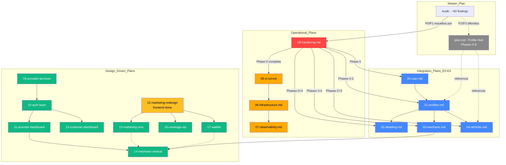

# Documentation Index — RayCarWash

> **Last updated:** 2026-05-19
> **Purpose:** Single entry point for all project documentation, plans, and audits.
> **Convention:** Every new plan MUST register here before creation.

---

## 1. Document Categories

| Category | Directory | Description |
|----------|-----------|-------------|
| **Master Plan** | [`/plan.md`](../plan.md) | Profile system Phases 0–9. **In execution — read-only.** |
| **Integration Plans** | [`docs/integration_plans/`](./integration_plans/) | Vertical product extensions (multi-profile, vehicles, mechanic) |
| **Technical Audit** | [`docs/audit/`](./audit/) | ~60 findings across architecture, tests, infra, web, DB |
| **Operational Plans** | [`docs/plans/`](./plans/) | CI/CD, infrastructure, observability, hardening |
| **Reference Docs** | [`docs/`](./) | API, backend, frontend, portal references + ADRs |

---

## 2. Dependency Graph



---

## 3. Plan Status

| Plan | Status | Priority | Hard Dependencies | Soft Dependencies |
|------|--------|----------|-------------------|------------------|
| `plan.md` (Profile Phases 0–9) | :construction: **In execution** | — | — | — |
| `00-user.md` | :hourglass: Planning | Medium | `08-hardening.md` Phase 0 | — |
| `01-profiles.md` | :hourglass: Planning | High | `08-hardening.md` Phases 0-2, `00-user.md` | — |
| `02-detailing.md` | :hourglass: Planning | Medium | `08-hardening.md` Phases 0+4, `01-profiles.md` | — |
| `03-mechanic.md` | :hourglass: Planning | Medium | `08-hardening.md` Phases 0-4, `02-detailing.md` | — |
| `04-vehicles.md` | :hourglass: Planning | Medium | `08-hardening.md` Phases 0+3, `01-profiles.md` | — |
| `05-ci-cd.md` | :page_facing_up: Draft | **Critical** | `08-hardening.md` Phase 0 | — |
| `06-infrastructure.md` | :page_facing_up: Draft | High | `05-ci-cd.md` | `08-hardening.md` Phase 0 |
| `07-observability.md` | :page_facing_up: Draft | Medium | `06-infrastructure.md` | `08-hardening.md` Phase 2 |
| `08-hardening.md` | :page_facing_up: Draft | **Critical** | — | — |
| `09-provider-services-integration.md` | :hourglass: Planning | Medium | `plan.md` Phase 5 | — |
| `10-authorization-layer.md` | :recycle: **Absorbed by `23-auth-hardening.md` Fases 3-4** | High | — | — |
| `11-provider-dashboard.md` | :hourglass: Planning | High | `09-provider-services-integration.md`, `23-auth-hardening.md` | `15-marketing-content-cms.md` |
| `12-marketing-redesign.md` | :white_check_mark: Phases 1-4 frontend complete | High | — | `11`, `15`, `16`, `17` |
| `13-customer-dashboard.md` | :hourglass: Planning | High | `04-vehicles.md`, `11-provider-dashboard.md` | `15-marketing-content-cms.md` |
| `14-mechanic-vertical.md` | :hourglass: Planning | Medium | `03-mechanic.md`, `09`, `11`, `15`, `17` | — |
| `15-marketing-content-cms.md` | :hourglass: Planning | Medium | `12-marketing-redesign.md` | — |
| `16-coverage-zip-service.md` | :hourglass: Planning | Medium-High | `infrastructure/h3` | `15-marketing-content-cms.md` |
| `17-waitlist-system.md` | :hourglass: Planning | Medium | `infrastructure/email` | `15-marketing-content-cms.md` |
| `19-api-contracts-track1-marketing.md` | :white_check_mark: **Done — 9/9 endpoints shipped** | High | — | `12-marketing-redesign.md`, `15`, `16`, `17` |
| `20-api-contracts-track2-provider-dashboard.md` | :white_check_mark: Contract — approved | High | `11-provider-dashboard.md`, `09` | — |
| `21-api-contracts-track3-customer-dashboard.md` | :construction: **In progress — §2 cancel shipped** | Medium | `13-customer-dashboard.md`, `04-vehicles.md` | — |
| **`22-security-architecture-audit.md`** | :construction: **In progress — H1 fixed in code; D1-D8 reconciled** | **Critical** | `19`, `20`, `21` (remediation applied) | All Plans |
| **`23-auth-hardening.md`** | :construction: **Fase 1 day 1 done (Session ORM + migration)** | **Critical** | None | — (absorbe `10-authorization-layer.md`) |
| **`24-auth-pages-and-admin-dashboard.md`** | :white_check_mark: **Wave 1 done · Wave 2 complete (A/B/C/D/E)** (Wave 1: 8 items; Wave 2: ops dashboard + appointment refund/reassign + detailer approve/suspend + reviews moderation + customers/credits — all shipped; P-4/P-5/S-2/C-2 still deferred to Waves 3-4) | High | `22`, `23`, `m_019` | `19`, `20`, `21` |
| `25-designer-to-next-frontend.md` | :hourglass: Planning | High | — (frontend port only) | `11`, `13`, `24` (data session swaps mocks) |
| `26-mock-to-backend-data-wiring.md` | :hourglass: Planning | High | `25` (provides the `lib/mock/*` seams) | `11`, `13`, `14`, `24`, `19`, `20`, `21` |

---

## 4. Audit Traceability Matrix

Cada hallazgo del audit se mapea al plan que lo resuelve:

| Plan | Hallazgos que Resuelve | Audit Source |
|------|----------------------|-------------|
| `08-hardening.md` Phase 0 | C3, C4, H1, H3, H5, H6, M3, M10 | `01-architecture`, `03-infrastructure` |
| `08-hardening.md` Phase 1A | H14 | `04-web-frontend` |
| `08-hardening.md` Phase 1B | M1 | `01-architecture` |
| `08-hardening.md` Phase 2 | C1, C2, C7, M4, M6, M7 | `01-architecture`, `02-test-gaps` |
| `08-hardening.md` Phase 3 | H7, M20 | `05-db-schema` |
| `08-hardening.md` Phase 4 | C5, C6, H9, H10, H11, H12 | `02-test-gaps` |
| `05-ci-cd.md` | L14, L15, L16, L17, L18 | `04-web-frontend`, `03-infrastructure` |
| `06-infrastructure.md` | M5, M11, M12, L13 | `03-infrastructure`, `04-web-frontend` |
| `07-observability.md` | H15, L08, L09, L10, M17 | `03-infrastructure` |
| `plan.md` Phase 5 | Service layer reorg (AdminService, PaymentsRepo) | `01-architecture` |
| `plan.md` Phase 6 | Active role switcher | `01-architecture` |
| `01-profiles.md` (E1) | ProviderProfile 1:N refactor | `01-architecture` |
| `10-authorization-layer.md` | Enforcement inconsistente — **absorbido por** `23-auth-hardening.md` Fases 3-4 | `01-architecture` (hallazgos de exploración) |
| **`23-auth-hardening.md`** | Auth gaps: session binding, device tracking, RBAC runtime, ABAC, anomaly detection | Internal auth architecture audit |
| `11-provider-dashboard.md` | Backend gaps surfaced by design audit: earnings time-series, JobOffer/matching split, payouts, ledger, supplies, promo codes | Design source: `raycarwash/project/` dash-*.jsx (12 views) |
| `13-customer-dashboard.md` | Backend gaps: composite home, vehicle stats, subscriptions, loyalty, referrals, favorites, receipt PDFs | Design source: `cdash.css` + HTML manifest |
| `14-mechanic-vertical.md` | Service category split, parts catalog, ASE cert tracking, OBD-II diagnostics, warranty model | Design source: `mechanic.jsx` |
| `15-marketing-content-cms.md` | Hardcoded testimonials/FAQ/coverage/stats — admin CMS for non-engineer edits | Design source: marketing i18n audit |
| `16-coverage-zip-service.md` | No `service_zip_codes` table — Coverage.tsx uses hardcoded 5-ZIP allowlist | Design source: `Coverage.tsx` + `dash-schedule.jsx` zones |
| `17-waitlist-system.md` | Mechanic/coverage waitlist forms only have client state, no persistence | Design source: `MechanicHero/CTA.tsx` + `Coverage.tsx` notify-me |
| **`22-security-architecture-audit.md`** | 10 findings (H1–H10) across 32 endpoints — remediated via contract updates + future migrations | Audit of contract plans 19/20/21 |
> **Full mapping**: See [`docs/audit/06-cross-reference-and-standards.md`](./audit/06-cross-reference-and-standards.md) section 3

---

## 5. Skills Reference

| # | Skill | Discipline | When to Use |
|---|-------|-----------|-------------|
| 01 | [`docs/skills/01-backend-api-security.md`](./skills/01-backend-api-security.md) | Security | Before writing any new API endpoint |
| 02 | [`docs/skills/02-backend-performance.md`](./skills/02-backend-performance.md) | Performance | When designing aggregate queries or cache strategy |
| 03 | [`docs/skills/03-backend-observability.md`](./skills/03-backend-observability.md) | Observability | When adding new endpoints or workers |
| 04 | [`docs/skills/04-api-contracts-quality.md`](./skills/04-api-contracts-quality.md) | Quality | Before finalizing any API contract |
| 05 | [`docs/skills/05-codebase-migrations.md`](./skills/05-codebase-migrations.md) | DevOps | When restructuring directories across the monorepo |

Skills are **codified professional expertise** for reuse across sprints. Each skill contains checklists, common pitfalls, and real codebase examples. See [`docs/skills/INDEX.md`](./skills/INDEX.md) for the full skill map.

---

## 6. How to Add a New Plan

1. **Choose number**: Next available in `docs/plans/{NN}-{name}.md`
2. **Create file**: Follow the template below
3. **Register here**: Add entry to section 3 (Plan Status)
4. **Map audits**: If the plan resolves audit findings, add to section 4
5. **Update cross-refs**: `AGENTS.md`, `docs/INDEX.md`, relevant plan READMEs

### Plan Template

```markdown
# {NN} — {Plan Name}

> **Status:** {Planning | Draft | In Progress | Done}
> **Priority:** {Critical | High | Medium | Low}
> **Dependencies:** {list of plan numbers or "None"}
> **Audit findings resolved:** {list of finding IDs or "N/A"}

## 1. Objective
## 2. Scope
## 3. Execution Phases
## 4. Verification
## 5. Risks
```

---

## 7. Quick Reference

| What | Where |
|------|-------|
| RBAC seed config | `backend/app/db/seed_rbac.py` |
| JWT config | `backend/app/core/config.py` |
| DB models | `backend/domains/*/models.py` |
| API routes | `backend/api/router.py` |
| Alembic migrations | `backend/alembic/versions/` |
| Docker services | `docker-compose.yml` |
| Tests | `backend/tests/*.py` |
