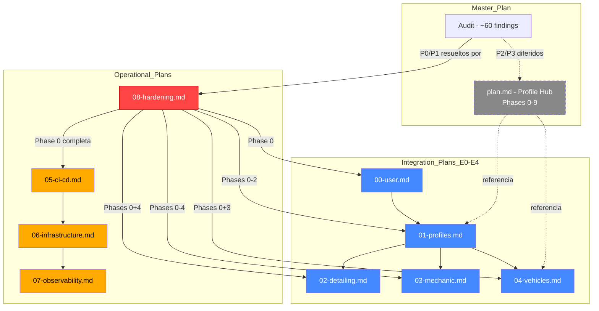

# Documentation Index — RayCarWash

> **Last updated:** 2026-05-17
> **Purpose:** Single entry point for all project documentation, plans, and audits.
> **Convention:** Every new plan MUST register here before creation.

---

## 1. Document Categories

| Category | Directory | Description |
|----------|-----------|-------------|
| **Master Plan** | [`/plan.md`](../plan.md) | Profile system Phases 0–9. **In execution — read-only.** |
| **Integration Plans** | [`docs/integration_plans/`](./integration_plans/) | Vertical product extensions (multi-profile, vehicles, mechanic) |
| **Technical Audit** | [`docs/audit/`](./audit/) | ~60 findings across architecture, tests, infra, web, DB |
| **Operational Plans** | [`docs/plans/`](./plans/) | CI/CD, infrastructure, observability, hardening |
| **Reference Docs** | [`docs/`](./) | API, backend, frontend, marketing references + ADRs |

---

## 2. Dependency Graph



---

## 3. Plan Status

| Plan | Status | Priority | Hard Dependencies | Soft Dependencies |
|------|--------|----------|-------------------|------------------|
| `plan.md` (Profile Phases 0–9) | :construction: **In execution** | — | — | — |
| `00-user.md` | :hourglass: Planning | Medium | `08-hardening.md` Phase 0 | — |
| `01-profiles.md` | :hourglass: Planning | High | `08-hardening.md` Phases 0-2, `00-user.md` | — |
| `02-detailing.md` | :hourglass: Planning | Medium | `08-hardening.md` Phases 0+4, `01-profiles.md` | — |
| `03-mechanic.md` | :hourglass: Planning | Medium | `08-hardening.md` Phases 0-4, `02-detailing.md` | — |
| `04-vehicles.md` | :hourglass: Planning | Medium | `08-hardening.md` Phases 0+3, `01-profiles.md` | — |
| `05-ci-cd.md` | :page_facing_up: Draft | **Critical** | `08-hardening.md` Phase 0 | — |
| `06-infrastructure.md` | :page_facing_up: Draft | High | `05-ci-cd.md` | `08-hardening.md` Phase 0 |
| `07-observability.md` | :page_facing_up: Draft | Medium | `06-infrastructure.md` | `08-hardening.md` Phase 2 |
| `08-hardening.md` | :page_facing_up: Draft | **Critical** | — | — |
| `09-provider-services-integration.md` | :hourglass: Planning | Medium | `plan.md` Phase 5 | — |
| `10-authorization-layer.md` | :hourglass: Planning | High | `08-hardening.md` Phase 0 | `plan.md` Phase 6 |

---

## 4. Audit Traceability Matrix

Cada hallazgo del audit se mapea al plan que lo resuelve:

| Plan | Hallazgos que Resuelve | Audit Source |
|------|----------------------|-------------|
| `08-hardening.md` Phase 0 | C3, C4, H1, H3, H5, H6, M3, M10 | `01-architecture`, `03-infrastructure` |
| `08-hardening.md` Phase 1A | H14 | `04-web-frontend` |
| `08-hardening.md` Phase 1B | M1 | `01-architecture` |
| `08-hardening.md` Phase 2 | C1, C2, C7, M4, M6, M7 | `01-architecture`, `02-test-gaps` |
| `08-hardening.md` Phase 3 | H7, M20 | `05-db-schema` |
| `08-hardening.md` Phase 4 | C5, C6, H9, H10, H11, H12 | `02-test-gaps` |
| `05-ci-cd.md` | L14, L15, L16, L17, L18 | `04-web-frontend`, `03-infrastructure` |
| `06-infrastructure.md` | M5, M11, M12, L13 | `03-infrastructure`, `04-web-frontend` |
| `07-observability.md` | H15, L08, L09, L10, M17 | `03-infrastructure` |
| `plan.md` Phase 5 | Service layer reorg (AdminService, PaymentsRepo) | `01-architecture` |
| `plan.md` Phase 6 | Active role switcher | `01-architecture` |
| `01-profiles.md` (E1) | ProviderProfile 1:N refactor | `01-architecture` |
| `10-authorization-layer.md` | Enforcement inconsistente (inline checks, falta `require_permission()`) | `01-architecture` (hallazgos de exploración) |

> **Full mapping**: See [`docs/audit/06-cross-reference-and-standards.md`](./audit/06-cross-reference-and-standards.md) section 3

---

## 5. How to Add a New Plan

1. **Choose number**: Next available in `docs/plans/{NN}-{name}.md`
2. **Create file**: Follow the template below
3. **Register here**: Add entry to section 3 (Plan Status)
4. **Map audits**: If the plan resolves audit findings, add to section 4
5. **Update cross-refs**: `AGENTS.md`, `docs/INDEX.md`, relevant plan READMEs

### Plan Template

```markdown
# {NN} — {Plan Name}

> **Status:** {Planning | Draft | In Progress | Done}
> **Priority:** {Critical | High | Medium | Low}
> **Dependencies:** {list of plan numbers or "None"}
> **Audit findings resolved:** {list of finding IDs or "N/A"}

## 1. Objective
## 2. Scope
## 3. Execution Phases
## 4. Verification
## 5. Risks
```

---

## 6. Quick Reference

| What | Where |
|------|-------|
| RBAC seed config | `backend/app/db/seed_rbac.py` |
| JWT config | `backend/app/core/config.py` |
| DB models | `backend/domains/*/models.py` |
| API routes | `backend/api/router.py` |
| Alembic migrations | `backend/alembic/versions/` |
| Docker services | `docker-compose.yml` |
| Tests | `backend/tests/*.py` |
